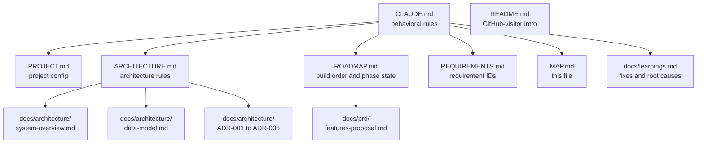

# MAP.md

> Navigation index for Claude. Read this first when looking for a specific topic — it points to the smallest file that answers the question, instead of grepping the tree or opening multiple docs.

## Doc landscape



## When you need X, read Y

| If you need to know… | Read |
|---|---|
| What the project is, MVP scope, decided stack | `PROJECT.md` |
| Behavioral rules (TDD, simplicity, swap test, etc.) | `CLAUDE.md` |
| What phase we're in, what to build next | `ROADMAP.md` |
| Stable requirement IDs for tests, ADRs, PRs | `REQUIREMENTS.md` |
| Adapter boundaries, vendor-SDK rules, structural patterns | `ARCHITECTURE.md` |
| Component responsibilities and key data flows | `docs/architecture/system-overview.md` |
| Entities, field types, status state machines | `docs/architecture/data-model.md` |
| Why FastAPI + Next.js | `docs/architecture/ADR-001-tech-stack.md` |
| Why Cloud Run + Vercel | `docs/architecture/ADR-002-deployment.md` |
| Why Supabase | `docs/architecture/ADR-003-database.md` |
| Chatbot design (Claude Tool Use, grounding contract) | `docs/architecture/ADR-004-ai-chatbot.md` |
| Notifications design (Telegram for adoption alerts) | `docs/architecture/ADR-005-notifications.md` |
| Voice-note admin agent (post-MVP) | `docs/architecture/ADR-006-telegram-admin-agent.md` |
| Backlog ideas / longer-term feature pitches | `docs/prd/features-proposal.md` |
| Root causes and fixes from earlier work | `docs/learnings.md` |
| GitHub-facing project intro | `README.md` |

## Project root layout

```
.
├── CLAUDE.md            Behavioral rules (read first for any non-trivial task)
├── PROJECT.md           Project config: stack, tests, skills, agents, conventions
├── ARCHITECTURE.md      Architecture rules and swap-test guidance
├── ROADMAP.md           Phased build order; source of truth for "what next"
├── REQUIREMENTS.md      Requirement IDs with v1 / v2 / out-of-scope labels
├── MAP.md               This file
├── README.md            GitHub-visitor intro
├── docs/
│   ├── learnings.md     Root causes & fixes — read before features, write before "done"
│   ├── architecture/    system-overview.md, data-model.md, ADR-001 … ADR-006
│   └── prd/             features-proposal.md (and future PRDs)
├── scripts/             Maintenance scripts
├── templates/           Doc scaffolding templates
└── .claude/             Claude-specific config, skills, agents, settings
```

## Files Claude should not read

- `WORKFLOW.md` — personal reference maintained by the user. Also blocked at the tool layer in `.claude/settings.local.json`.
