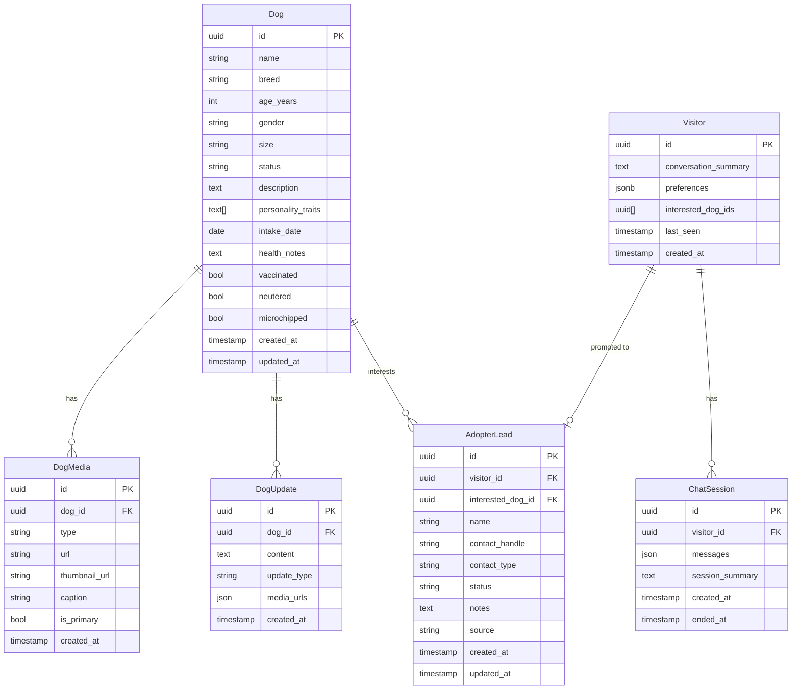

# Doggies — Data Model

**Version:** 1.1
**Last Updated:** 2026-04-24

---

## Entity Overview



---

## Entity Definitions

### Dog

The core entity. Represents a dog currently or previously at the shelter.

| Field | Type | Notes |
|-------|------|-------|
| `id` | UUID | Primary key |
| `name` | string | Dog's name |
| `breed` | string | Breed or "Mixed" |
| `age_years` | int | Approximate age |
| `gender` | enum | `male` \| `female` |
| `size` | enum | `small` \| `medium` \| `large` |
| `status` | enum | `available` \| `fostered` \| `adopted` \| `pending` \| `medical_hold` |
| `description` | text | Public-facing bio |
| `personality_traits` | string[] | e.g. `["calm", "good with kids", "independent"]` |
| `intake_date` | date | When the dog arrived |
| `health_notes` | text | Internal health record summary |
| `vaccinated` | bool | Vaccination status |
| `neutered` | bool | Neutered/spayed status |
| `microchipped` | bool | Microchip status |

---

### DogMedia

Photos and videos attached to a dog.

| Field | Type | Notes |
|-------|------|-------|
| `type` | enum | `photo` \| `video` |
| `url` | string | Full URL to stored file |
| `thumbnail_url` | string | For videos, a poster frame |
| `is_primary` | bool | Profile photo flag |

---

### DogUpdate

Diary-style updates posted by the admin for each dog. Visible on the dog's public profile.

| Field | Type | Notes |
|-------|------|-------|
| `update_type` | enum | `health` \| `mood` \| `activity` \| `milestone` \| `general` |
| `content` | text | The update text |
| `media_urls` | JSON | Optional attached photos/videos |

---

### Visitor

An anonymous but persistent identity for each chatbot user. Created on first visit, recognised on return.

| Field | Type | Notes |
|-------|------|-------|
| `id` | UUID | Generated on first visit; stored in browser `localStorage` |
| `conversation_summary` | text | AI-generated summary of what we know about this visitor — refreshed after each session |
| `preferences` | JSONB | Structured preferences extracted from conversations (see below) |
| `interested_dog_ids` | UUID[] | Dogs the visitor has expressed interest in across all sessions |
| `last_seen` | timestamp | Updated on every chat request |

**Preferences schema (JSONB):**
```json
{
  "living_situation": "apartment",
  "has_garden": false,
  "hours_home_per_day": 8,
  "experience_with_dogs": "first-time",
  "other_pets": false,
  "children_at_home": false,
  "preferred_size": "small",
  "preferred_energy": "calm"
}
```

Fields are populated progressively as the chatbot learns more about the visitor through conversation. Never assumed — only written when the visitor explicitly states something.

**Identity mechanism:**
- On first chat request, the browser generates a UUID and stores it in `localStorage`.
- All subsequent requests include this UUID as a header (`X-Visitor-ID`).
- FastAPI looks up or creates the `Visitor` record on each request.
- If the user clears `localStorage` or switches browsers, a new `Visitor` is created — this is acceptable for MVP.

---

### ChatSession

One continuous conversation with the chatbot. A visitor may have many sessions across different visits.

| Field | Type | Notes |
|-------|------|-------|
| `id` | UUID | Primary key |
| `visitor_id` | UUID FK | Links to the persistent `Visitor` record |
| `messages` | JSON | Array of `{role, content, timestamp}` |
| `session_summary` | text | AI-generated summary of this specific session, written when the session ends |
| `ended_at` | timestamp | Set when the session closes (user leaves, or idle timeout) |

**Session lifecycle:**
```
Visitor opens chat
  → New ChatSession created (visitor_id set)
  → Visitor.conversation_summary + last session messages injected into Claude context
  → Conversation proceeds, messages appended to ChatSession.messages

Session ends (user leaves / idle 30 min timeout)
  → Claude generates session_summary from messages
  → Visitor.conversation_summary regenerated from all session summaries
  → Visitor.preferences updated with any newly extracted structured data
  → ChatSession.ended_at set
```

**Context injection on return:**
```
"Returning visitor context:
  Summary: This visitor is a first-time dog owner living in an apartment.
           They showed strong interest in Bella (small, calm). They asked
           about vaccination requirements and whether small dogs are
           suitable for apartments.
  Last seen: 3 days ago.

Continue the conversation naturally. Don't mention you have a summary."
```

---

### AdopterLead

Created when a visitor identifies themselves (provides name and contact). Promoted from an anonymous `Visitor`.

| Field | Type | Notes |
|-------|------|-------|
| `visitor_id` | UUID FK | The anonymous visitor this lead was promoted from |
| `interested_dog_id` | UUID FK | Nullable — may not specify a dog |
| `contact_handle` | string | Telegram username, email, etc. |
| `contact_type` | enum | `telegram` \| `email` \| `instagram` |
| `status` | enum | `new` \| `contacted` \| `meeting_scheduled` \| `applied` \| `adopted` \| `closed` |
| `source` | enum | `chatbot` \| `direct` |

**Visitor → Lead promotion:**
When the chatbot collects the visitor's name and contact (e.g., "What's your Telegram so the admin can reach you?"), the system creates an `AdopterLead` linked to the existing `Visitor`. All previous conversation history is automatically associated via the `visitor_id` chain.

---

## Status Transitions

### Dog Status
```
[intake] → available → pending → adopted
                     ↓
                  fostered → available
                     ↓
               medical_hold → available
```

### AdopterLead Status
```
new → contacted → meeting_scheduled → applied → adopted
 ↓                                              ↓
closed (not interested)               closed (other shelter)
```

---

## Notes

- **No donor table in MVP.** Donations go to an external crowdfunding site; no payment data is stored.
- **Admin user** managed via Supabase Auth (single user for MVP). No user table needed.
- **pgvector** column (`embedding vector(1536)`) added to `Dog` in Phase 2 for semantic search. Schema accommodates this without a destructive migration.
- **Visitor privacy:** No PII is stored in the `Visitor` table unless the visitor explicitly provides it (at which point it moves to `AdopterLead`). The `conversation_summary` is a behaviour profile, not an identity record.
