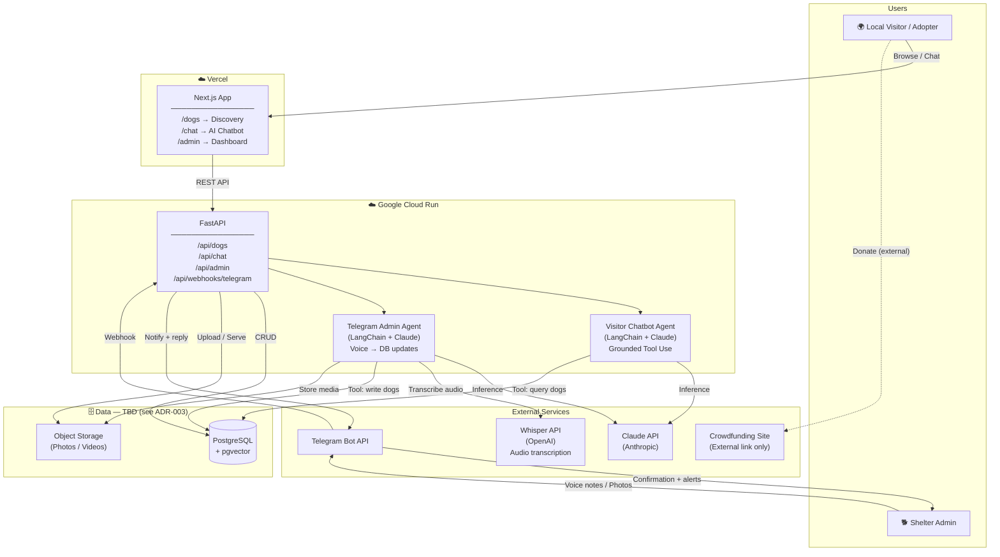

# Doggies — System Architecture Overview

**Version:** 1.1  
**Status:** Draft — DB decision pending (see ADR-003)  
**Last Updated:** 2026-04-24

---

## Purpose

Doggies is a platform for a dog shelter on Koh Phangan, Thailand, designed to:
- Increase dog **visibility** among locals on the island (primary target: Koh Phangan residents)
- Drive **adoptions** by qualifying and matching local adopters with the right dog
- Sustain **funding** through donations
- Reduce **admin burden** for the single person running the shelter

> **Scope note:** MVP targets local adoption within Koh Phangan. International adoption (with its transport and regulatory complexity) is out of scope.

---

## MVP Scope

| Feature | Status |
|---------|--------|
| Telegram admin agent (voice-note DB updates) | MVP |
| Public dog discovery page | MVP |
| AI visitor chatbot (grounded, qualifying) | MVP |
| Database setup | MVP |
| Admin read-only dashboard (stats, leads) | MVP |
| Donation link (external crowdfunding) | MVP |
| Instagram auto-posting | Phase 2 |
| Instagram chatbot (top-of-funnel) | Phase 2 |
| Dog sponsorship (recurring donations) | Phase 2 |
| Observability layer | Phase 3 |
| Community / events / business directory | Phase 3 |

---

## High-Level Architecture



---

## Component Responsibilities

### Next.js App (Vercel)
- Server-side rendered public dog discovery (SEO-friendly)
- AI chatbot widget (streaming responses)
- Admin read-only dashboard: dog list, adopter leads, engagement stats
- Image/video display via `next/image`

### FastAPI Backend (Cloud Run)
- All business logic and data access
- Dog CRUD endpoints
- Media upload handling
- Visitor chat endpoint (proxies to Visitor Chatbot Agent)
- Telegram webhook receiver (proxies to Telegram Admin Agent)
- Adoption intent detection → Telegram alert to admin

### Visitor Chatbot Agent
- Receives visitor message + conversation history
- Uses Claude Tool Use (strict two-layer grounding contract — see ADR-004)
- Only surfaces dog-specific facts from tool results; never fabricates
- Qualifies adopters; helps visitors understand if they're a good fit
- Triggers Telegram admin notification on adoption intent

### Telegram Admin Agent
- Receives voice notes, photos, and text from the shelter admin via Telegram
- Transcribes voice audio via Whisper API
- Extracts intent and structured data (new dog, status update, diary post)
- Asks clarifying questions if info is incomplete
- Writes to DB via write tools; stores media in object storage
- Confirms each action back to admin via Telegram reply
- See [ADR-006](ADR-006-telegram-admin-agent.md) for full design

### Admin Dashboard (Next.js, read-only)
- View all dogs with current status
- View adopter leads and their funnel stage
- View recent chatbot conversations (anonymised)
- No data entry — all updates go through the Telegram Admin Agent

### Database (Proposed: Supabase — see ADR-003)
- PostgreSQL: dogs, media, updates, adopter leads, chat sessions, admin Telegram sessions
- pgvector: ready for Phase 2 semantic search
- Auth: admin JWT
- Storage: photos and videos

---

## Data Flow: Key Scenarios

### 1. Admin Adds a New Dog (via Telegram voice note)
```
Admin sends voice note: "New dog, female, small, 2 years, mixed breed, 
                         very shy, name is Luna, not vaccinated yet"
  → Telegram Bot receives audio file
  → FastAPI /api/webhooks/telegram
  → Whisper API transcribes audio
  → Admin Agent extracts: {name: Luna, gender: female, size: small, 
                            age: 2, traits: ["shy"], vaccinated: false}
  → Admin Agent calls: create_dog(...)
  → PostgreSQL insert
  → Admin Agent replies via Telegram: "✅ Luna added as available"
```

### 2. Visitor Discovers Dogs
```
Visitor loads /dogs (Next.js SSR)
  → GET /api/dogs (FastAPI)
  → Query PostgreSQL (status = available)
  → Return dog list with media URLs
  → Renders dog cards with photos
```

### 3. Visitor Chats with AI (qualified, grounded)
```
Visitor: "I live in a small apartment, I'm home most of the day"
  → Visitor Chatbot Agent receives message
  → Claude reasons about lifestyle fit (no tool needed yet)
  → Claude: "Sounds like a calm, lower-energy dog would suit you. 
              Let me find what's available..."
  → Claude calls: search_dogs(traits=["calm"])
  → Tool returns: [{name: Bella, breed: mixed, ...}]
  → Claude responds with Bella's actual profile data (tool-grounded only)
```

### 4. Adoption Interest Detected
```
Visitor: "I'd love to meet Bella"
  → Visitor Chatbot Agent detects adoption intent
  → FastAPI dispatches Telegram notification to admin
  → Admin receives: "🐕 Adoption interest: Bella
                     Visitor: @username
                     → /admin/leads"
```

---

## Technology Summary

| Layer | Technology | Hosting |
|-------|-----------|---------|
| Frontend | Next.js 15 (App Router) | Vercel |
| Backend | FastAPI (Python 3.12) | Google Cloud Run |
| Visitor AI Agent | LangChain + Claude API | Inside Cloud Run |
| Telegram Admin Agent | LangChain + Claude API + Whisper | Inside Cloud Run |
| Audio Transcription | OpenAI Whisper API | External (SaaS) |
| Database | PostgreSQL + pgvector | TBD (see ADR-003) |
| Media Storage | Object storage | TBD (see ADR-003) |
| Notifications + Admin input | Telegram Bot API | External (managed) |
| Auth | JWT (admin only) | FastAPI |
| Donations | External crowdfunding link | N/A |
| Observability | TBD | Phase 3 |

---

## Architecture Decision Records

| ADR | Decision | Status |
|-----|----------|--------|
| [ADR-001](ADR-001-tech-stack.md) | FastAPI + Next.js as primary stack | Accepted |
| [ADR-002](ADR-002-deployment.md) | Cloud Run (backend) + Vercel (frontend) | Accepted |
| [ADR-003](ADR-003-database.md) | Supabase (PostgreSQL + Storage) | **Proposed** |
| [ADR-004](ADR-004-ai-chatbot.md) | Claude Tool Use + strict grounding contract | Accepted |
| [ADR-005](ADR-005-notifications.md) | Telegram for admin notifications | Accepted |
| [ADR-006](ADR-006-telegram-admin-agent.md) | Telegram voice-note admin agent | Accepted |
