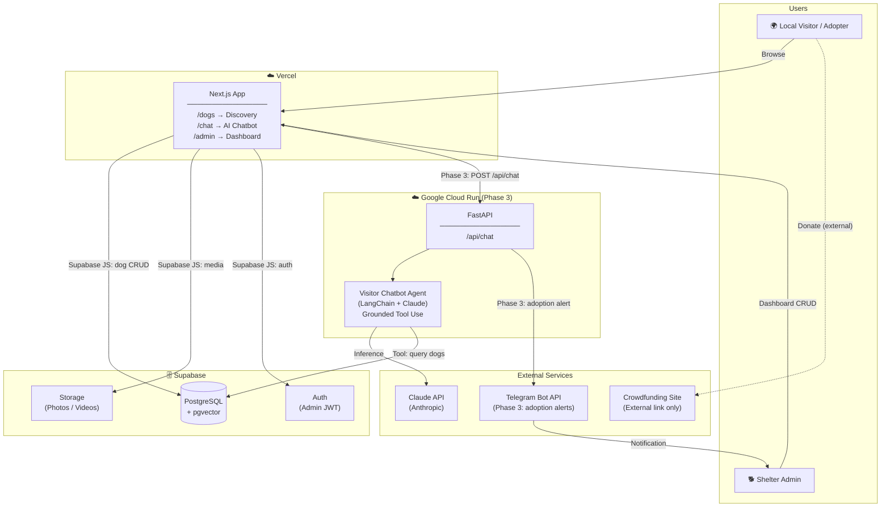

# Doggies — System Architecture Overview

**Version:** 1.3  
**Status:** Active  
**Last Updated:** 2026-05-13

---

## Purpose

Doggies is a platform for a dog shelter on Koh Phangan, Thailand, designed to:
- Increase dog **visibility** among locals on the island (primary target: Koh Phangan residents)
- Drive **adoptions** by qualifying and matching local adopters with the right dog
- Sustain **funding** through donations
- Reduce **admin burden** for the single person running the shelter

> **Scope note:** MVP targets local adoption within Koh Phangan. International adoption (with its transport and regulatory complexity) is out of scope.

---

## MVP Scope

The MVP is split into three sequential phases, each independently deployable and testable.

### MVP Phase 1 — Frontend Shell

| Feature | Notes |
|---------|-------|
| Public dog discovery page | Placeholder/mock data |
| Admin dashboard | Full UI with placeholder data; CRUD wired in Phase 2 |
| Donation link | Static external link — no backend needed |

**Deployment target:** Vercel (auto CI/CD via GitHub Actions)

### MVP Phase 2 — Database Integration

| Feature | Notes |
|---------|-------|
| Supabase setup (DB + Auth + Storage) | Schema, RLS policies, seed data |
| Discovery page → Supabase | Real dog data via Supabase JS client |
| Admin dashboard → Supabase | Full CRUD: dogs, leads, media via Supabase JS client |

**Deployment target:** Vercel (no new infrastructure; Supabase is managed)

### MVP Phase 3 — AI Chatbot

| Feature | Notes |
|---------|-------|
| FastAPI backend | First backend deployment; Cloud Run CI/CD via GitHub Actions |
| Visitor AI chatbot | Claude Tool Use, strict grounding contract (see ADR-004) |
| Chatbot widget on discovery page | Streaming responses via SSE |
| Adoption intent → admin notification | Chatbot calls `signal_adoption_intent` tool → Telegram alert |

**Deployment target:** Google Cloud Run (new) + Vercel (updated)

### Post-MVP Roadmap

| Feature | Phase |
|---------|-------|
| Telegram admin agent (voice-note DB updates) | Phase 2 |
| Instagram auto-posting | Phase 2 |
| Instagram chatbot (top-of-funnel) | Phase 2 |
| Dog sponsorship (recurring donations) | Phase 2 |
| Observability layer | Phase 3 |
| Community / events / business directory | Phase 3 |

---

## High-Level Architecture



---

## Component Responsibilities

### Next.js App (Vercel)
- Server-side rendered public dog discovery (SEO-friendly)
- AI chatbot widget (streaming responses)
- Admin dashboard: dog list + inline editing, adopter leads + inline editing, chatbot conversation viewer, media upload
- Image/video display via `next/image`

### FastAPI Backend (Cloud Run) — Phase 3 only
- Chat endpoint `/api/chat` (proxies to Visitor Chatbot Agent)
- No CRUD endpoints — all dog/lead/media CRUD goes through Supabase JS client from Next.js

### Visitor Chatbot Agent — Phase 3 only
- Receives visitor message + conversation history
- Uses Claude Tool Use (strict two-layer grounding contract — see ADR-004)
- Only surfaces dog-specific facts from tool results; never fabricates
- Qualifies adopters; helps visitors understand if they're a good fit
- Calls `signal_adoption_intent` tool → FastAPI dispatches Telegram alert to admin

### Admin Dashboard (Next.js)
- View all dogs with status + last update date; inline-edit any dog field
- View all adopter leads with contact info + last status; inline-edit status and notes
- View last N chatbot conversations (default 10, configurable) — Phase 3
- Upload photos and videos to a dog's media gallery
- Primary write interface for the admin in MVP (Telegram admin agent deferred to Phase 2 roadmap)

### Database (Supabase — see ADR-003)
- PostgreSQL: dogs, media, updates, adopter leads, chat sessions
- RLS (Row Level Security) policies required — Next.js accesses Supabase directly from the browser
- pgvector: ready for Phase 2 semantic search
- Auth: Supabase Auth (admin JWT)
- Storage: photos and videos

---

## Data Flow: Key Scenarios

### 1. Admin Adds a New Dog (via Dashboard)
```
Admin opens /admin/dogs (Next.js)
  → Fills form: name, breed, age, gender, size, traits, health status
  → Supabase JS client: INSERT INTO dogs (RLS validates admin JWT)
  → Uploads photo via Supabase Storage JS client
  → Dog immediately visible on /dogs discovery page
```

### 2. Visitor Discovers Dogs
```
Visitor loads /dogs (Next.js SSR)
  → Supabase JS client: SELECT * FROM dogs WHERE status = 'available'
  → Returns dog list with Supabase Storage media URLs
  → Renders dog cards with photos
```

### 3. Visitor Chats with AI (qualified, grounded)
```
Visitor: "I live in a small apartment, I'm home most of the day"
  → Visitor Chatbot Agent receives message
  → Claude reasons about lifestyle fit (no tool needed yet)
  → Claude: "Sounds like a calm, lower-energy dog would suit you. 
              Let me find what's available..."
  → Claude calls: search_dogs(traits=["calm"])
  → Tool returns: [{name: Bella, breed: mixed, ...}]
  → Claude responds with Bella's actual profile data (tool-grounded only)
```

### 4. Adoption Interest Detected
```
Visitor: "I'd love to meet Bella"
  → Visitor Chatbot Agent detects adoption intent
  → FastAPI dispatches Telegram notification to admin
  → Admin receives: "🐕 Adoption interest: Bella
                     Visitor: @username
                     → /admin/leads"
```

---

## Technology Summary

| Layer | Technology | Hosting | Phase |
|-------|-----------|---------|-------|
| Frontend | Next.js 15 (App Router) | Vercel | 1 |
| DB access (CRUD + Auth + Storage) | Supabase JS Client | Next.js (Vercel) | 2 |
| Database | PostgreSQL + pgvector | Supabase | 2 |
| Media Storage | Supabase Storage | Supabase | 2 |
| Auth | Supabase Auth (JWT) | Supabase | 2 |
| Backend (AI only) | FastAPI (Python 3.12) | Google Cloud Run | 3 |
| Visitor AI Agent | LangChain + Claude API | Inside Cloud Run | 3 |
| Adoption notifications | Telegram Bot API | External (managed) | 3 |
| Donations | External crowdfunding link | N/A | 1 |
| Telegram Admin Agent | LangChain + Claude API + Whisper | Cloud Run | Phase 2 roadmap |
| Observability | TBD | TBD | Phase 3+ |

---

## Architecture Decision Records

| ADR | Decision | Status |
|-----|----------|--------|
| [ADR-001](ADR-001-tech-stack.md) | FastAPI + Next.js as primary stack | Accepted |
| [ADR-002](ADR-002-deployment.md) | Cloud Run (backend) + Vercel (frontend) | Accepted |
| [ADR-003](ADR-003-database.md) | Supabase (PostgreSQL + Storage) | Accepted |
| [ADR-004](ADR-004-ai-chatbot.md) | Claude Tool Use + strict grounding contract | Accepted |
| [ADR-005](ADR-005-notifications.md) | Telegram for adoption intent alerts (Phase 3) | Accepted |
| [ADR-006](ADR-006-telegram-admin-agent.md) | Telegram voice-note admin agent | Deferred (Phase 2 roadmap) |
